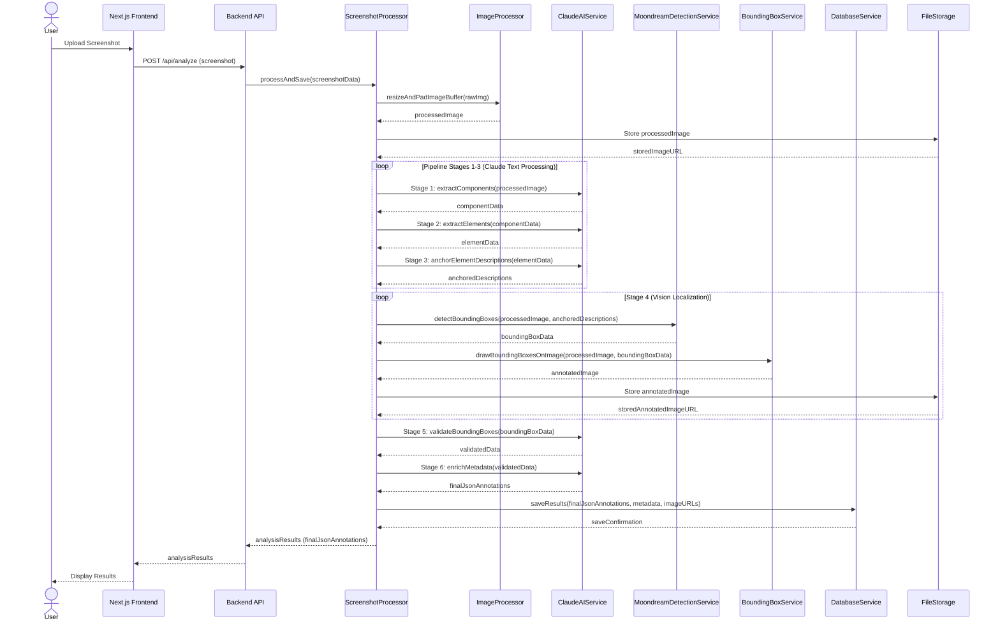
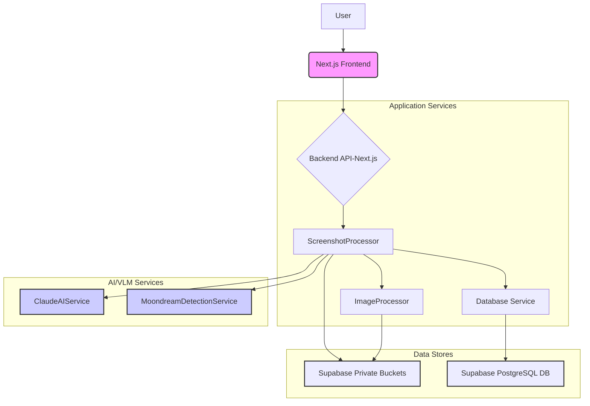

# UI Analyzer Demo: Detailed Pipeline & Code Reference README

---

## 1. Project Overview

Reimagining UX Annotation with MLLMs: Transforming UI screenshots into structured UX annotations using language and vision models.

This project explores the capabilities of vision-language models with zero shot prompts for automated UI analysis, particularly in challenging scenarios where components appear visually similar. Through a chain of carefully engineered prompts, we investigate whether these models can reliably extract, localize, and describe UI elements from screenshots.

### Key Techniques
| Approach | Description |
|----------|-------------|
| Zero-shot prompting | Direct instructions without examples |
| Few-shot prompting | Using examples to guide model behavior |
| Agentic prompting | Giving models specific roles/personas |

### Key Findings
| Finding | Details |
|---------|----------|
| Accuracy Challenges | Models struggle with visually similar UI components |
| Prompt Engineering | Extensive prompt tuning needed for basic accuracy |
| Production Readiness | Shows potential but needs significant improvement |


The project outputs structured JSON annotations and visual artifacts, serving as a foundation for further research in automated UX analysis.


---

## 2. Pipeline Overview

Seven-stage orchestrated pipeline transforming raw screenshots into detailed UX annotations:
1. Image preprocessing
2. High-level segmentation
3. Fine-grained extraction
4. Description refinement
5. Vision localization
6. Validation
7. Metadata enrichment

### High Level Diagrams



---

## 3. Pipeline Stages

### Stage 0: Image Preprocessing

| Aspect | Details |
|--------|----------|
| **Core Function** | Standardize images for consistent processing |
| **Key Operations** | - Scale to 800x800px bounds (maintain proportions)<br>- Add white borders<br>- Optimize for Claude token count<br>- Clean filenames |
| **Benefits** | - Consistent input size for Moondream model<br>- Uniform UI rendering<br>- Cost-effective processing |

* **How:**
  - Scale images to fit within 800x800px bounds while keeping their original proportions. No squashing, no stretching.
  - Add white borders to reach the exact 800x800 size. This standardization makes it easier to process images with the Moondream vision language model since all inputs are consistently sized.
  - Simplifies rendering results in the UI by maintaining uniform dimensions while keeping the actual UI content properly proportioned.
  - Optimized for Claude's token count. The 800x800 resolution keeps costs affordable 
  - Clean up filenames to avoid any special character issues in storage or processing.

* **Implementation Details:**
  - **Core Modules:**
    - `ImageProcessor.ts`: Handles the actual image manipulation
    - `ScreenshotProcessor.ts`: Manages the workflow and integration
  - **Processing Steps:**
    1. Validate the input - make sure it's a valid image file
    2. Resize to fit our target dimensions while keeping the aspect ratio intact
    3. Add white padding to reach the exact 800x800 size
    4. Convert to optimized JPEG format
    5. Clean up the filename for safe storage
    6. Prepare for storage and downstream processing

---

### **Stage 1: High-Level UI Component Extraction**

*   **Objective:** To identify and segment the primary, semantically meaningful UI components from the preprocessed screenshot. This stage focuses on delineating broad functional areas (e.g., "Navigation Bar," "Product Card List," "Checkout Form") rather than granular elements.
*   **Why This Matters:**
    *   **Contextual Foundation:** Identifying major components first provides a structural understanding of the UI, which guides the more detailed extraction in subsequent stages. It's like creating a chapter outline before writing the content.
    *   **Hierarchical Analysis:** This top-down approach allows for more organized and contextually relevant element identification later.
*   **How It Works (Design Decisions):**
    1.  **Input:** The standardized image buffer from Stage 0 and a signed URL 
    2.  **Model Choice & Prompting:** `OpenAIService.extract_component_from_image()` utilizes an OpenAI vision model (e.g., GPT-4o). The `EXTRACTION_PROMPT_v6` is engineered to instruct the model to focus on high-level, functionally distinct blocks, ignoring minor atomic elements at this stage.
    3.  **Output Parsing:** The LLM's response, expected to be a JSON list of components, is parsed into an array of objects, each containing `component_name` and `description`. This structure provides a simple yet effective summary for each identified component.

*   **Main Module:**
    *   [`OpenAIService.extract_component_from_image()`](/lib/services/ai/OpenAIService.js)
    *   Prompt: `EXTRACTION_PROMPT_v6` ([lib/prompt/prompts.ts])
*   **Typical Call (within `ParallelExtractionService.ts`):**
    ```typescript
    // signedUrl is the preprocessed image URL
    // context is for logging
    const componentResult = await extract_component_from_image(signedUrl, context);
    // componentResult.parsedContent will be an array of { component_name, description }
    ```

---

### **Stage 2: Fine-Grained UI Element Extraction**

*   **Objective:** To dissect each high-level component (identified in Stage 1) into its constituent, visually distinct UI elements (e.g., buttons, labels, icons, input fields within a "Checkout Form").
*   **Why This Matters:**
    *   **Detailed Inventory:** This stage creates a comprehensive inventory of all interactive and informational elements, crucial for detailed UX analysis and subsequent localization.
    *   **Scoped Analysis:** By operating within the context of a parent component, the model can more accurately identify and describe elements relevant to that specific section, reducing ambiguity.
*   **How It Works (Design Decisions):**
    1.  **Input:** The standardized image buffer (via `signedUrl`), and the list of `component_name` summaries from Stage 1.
    2.  **Iterative Contextual Prompting:** `ClaudeAIService.extract_element_from_image()` is called for the entire screen but uses the concatenated list of component names to provide context. The `EXTRACT_ELEMENTS_PROMPT_v2` guides the Claude model to identify elements within the broader UI, implicitly using the component list to understand the scope.
    3.  **Hierarchical Naming:** The model is prompted to return a flat map where keys often imply hierarchy (e.g., `Component Name > Element Label`). This structure is chosen for simplicity in this intermediate step.
    4.  **Data Aggregation:** The results are parsed into a single JSON object mapping these descriptive keys to their detailed descriptions.

*   **Main Module:**
    *   [`ClaudeAIService.extract_element_from_image()`](/lib/services/ai/ClaudeAIService.ts)
    *   Prompt: `EXTRACT_ELEMENTS_PROMPT_v2` ([lib/prompt/prompts.ts])
*   **Typical Call (within `ParallelExtractionService.ts`):**
    ```typescript
    // componentSummaries is an array of names from Stage 1
    const elementResult = await extract_element_from_image(signedUrl, componentSummaries.join('\n'), context);
    // elementResult.rawText contains the flat map as a string
    // elementResult.parsedContent contains the parsed JSON object
    ```

---

### **Stage 3: Anchor-Aware Description Refinement**

*   **Objective:** To enhance the descriptions of UI elements (from Stage 2) by incorporating "visual anchors"—references to nearby, stable elements—making them more robust for precise localization by vision models in Stage 4.
*   **Why This Matters:**
    *   **Disambiguation for VLMs:** Vision-Language Models (VLMs) can struggle to pinpoint small or generically described elements. Anchored descriptions (e.g., "the 'Login' button, to the right of the 'Username' input field") provide crucial relative spatial context, significantly improving localization accuracy.
    *   **Robustness to Visual Similarity:** When multiple similar elements exist, anchors help the VLM distinguish the correct target.
*   **How It Works (Design Decisions):**
    1.  **Input:** The standardized image (`signedUrl`) and the raw text string containing the flat map of element descriptions from Stage 2.
    2.  **Contextual Refinement Prompt:** `ClaudeAIService.anchor_elements_from_image()` uses the `ANCHOR_ELEMENTS_PROMPT_v3`. This prompt instructs the Claude model to rewrite each description, focusing on the element itself while subtly incorporating 1-2 nearby visual cues (text, icons) as anchors. The emphasis is on making the *target element* more findable, not describing the anchor.
    3.  **Preserving Focus:** The prompt design ensures anchors are phrased subordinately (e.g., "..., located below the 'Settings' icon") so the VLM's attention remains on the primary element being described.
    4.  **Output Structure:** The output is a flat JSON object (Record<string, string>) where keys are element identifiers (often hierarchical paths) and values are the new, anchor-enriched descriptions.
    5.  **Validation (Implicit):** While not a formal validation step with explicit metrics at this point, the prompt's design encourages clarity and the inclusion of useful anchors. The actual effectiveness of these anchored descriptions is practically validated by the performance of the bounding box detection in Stage 4.

*   **Main Module:**
    *   [`ClaudeAIService.anchor_elements_from_image()`](/lib/services/ai/ClaudeAIService.ts)
    *   Prompt: `ANCHOR_ELEMENTS_PROMPT_v3` ([lib/prompt/prompts.ts])
*   **Typical Call (within `ParallelExtractionService.ts`):**
    ```typescript
    // elementResult.rawText is the output from Stage 2
    const anchorResult = await anchor_elements_from_image(signedUrl, elementResult.rawText, context);
    // anchorResult.parsedContent contains the anchor-enriched descriptions
    ```

---

### **Stage 4: Vision-Based Bounding Box Detection**

*   **Objective:** To accurately localize each UI element (using its anchor-enriched description from Stage 3) by predicting its bounding box coordinates on the screenshot.
*   **Why This Matters:**
    *   **Spatial Understanding:** Bounding boxes provide the precise location and extent of UI elements, which is fundamental for many UX analysis tasks (e.g., heatmaps, accessibility checks, design compliance).
    *   **Foundation for Interaction:** Knowing element locations is a prerequisite for simulating user interactions or analyzing visual hierarchy.
*   **How It Works (Design Decisions):**
    1.  **Input:** The standardized image buffer and the anchor-enriched descriptions for each element (from Stage 3).
    2.  **VLM Specialization (Moondream):** `MoondreamDetectionService.detectBoundingBoxes()` utilizes a Vision-Language Model like Moondream, which is often more specialized for localization tasks compared to general-purpose LLMs with vision. Moondream is prompted with the image and one specific anchor-enriched description at a time.
    3.  **Iterative Detection:** The service iterates through each element description, making a separate call to the VLM for each to get its bounding box. This individualized approach ensures focus.
    4.  **Output:** For each element, the VLM returns predicted coordinates (x_min, y_min, x_max, y_max) and a confidence score.
    5.  **Normalization & Grouping:** All bounding box coordinates are normalized relative to the image dimensions (0-1 or 0-100 range) for consistency. Results are often grouped by their original high-level component for easier downstream processing and context.
    6.  **Visual Artifacts:** Annotated images are generated using `/lib/services/imageServices/BoundingBoxService.js`, overlaying the predicted boxes on the screenshot. This provides immediate visual feedback and aids in debugging. A `detection.json` file logs all predictions.
    7.  **Error Handling:** Low-confidence detections are flagged. If an element cannot be localized, it's typically marked as "not found."
*   **Main Module:**
    *   [`MoondreamDetectionService.detectBoundingBoxes()`](/lib/services/ai/MoondreamDetectionService.js)
*   **Typical Call:**
    ```javascript
    // imageBuffer is the preprocessed image
    // anchoredDescriptions is the output from Stage 3
    const boundingBoxes = await MoondreamDetectionService.detectBoundingBoxes(imageBuffer, anchoredDescriptions);
    // boundingBoxes will be an array of {id, label, coordinates, score, status}
    ```

---

### **Stage 5: Bounding Box Accuracy Validation & Correction**

*   **Objective:** To critically assess the accuracy of bounding boxes predicted by the VLM (Stage 4) and, where possible, suggest corrections to improve their precision.
*   **Why This Matters:**
    *   **Reliability of Localization:** VLMs, while powerful, are not infallible and can produce misaligned or inaccurately sized bounding boxes. This stage acts as a quality control mechanism.
    *   **Human-in-the-Loop (Simulated):** Using a more powerful LLM (like Claude) to review and correct the VLM's output mimics a human review process, enhancing overall accuracy without manual intervention for every box.
*   **How It Works (Design Decisions):**
    1.  **Input:** The original image, the bounding box JSON (from Stage 4) for each element, including its label and coordinates.
    2.  **LLM as Adjudicator:** `ClaudeAIService.validateBoundingBoxes()` sends the image, the element's description, and its predicted bounding box back to a capable LLM (Claude). The `ACCURACY_VALIDATION_PROMPT_v0` instructs the LLM to act as an expert verifier.
    3.  **Structured Feedback:** The LLM returns a structured assessment for each box:
        *   `accuracy` (0-100): An estimation of the box's correctness.
        *   `hidden` (boolean): Flags if the element is genuinely not visible or if the box is fundamentally incorrect.
        *   `status` (`Verified`, `Overwrite`): Indicates the outcome of the validation.
        *   `suggested_coordinates` (optional): If the LLM deems a correction feasible and accuracy is low, it provides new coordinates.
        *   `explanation`: A natural language rationale for its assessment.
    4.  **Automated Correction:** If `status` is `Overwrite` the pipeline can automatically replace the original VLM box with the LLM's `suggested_coordinates`.
*   **Main Module:**
    *   [`ClaudeAIService.validateBoundingBoxes()`](/lib/services/ai/ClaudeAIService.ts)
    *   Prompt: `ACCURACY_VALIDATION_PROMPT_v0` ([lib/prompt/prompts.ts])
*   **Typical Call:**
    ```typescript
    // boundingBoxes is the output from Stage 4
    // imageBuffer is the preprocessed image
    const validatedBoxes = await ClaudeAIService.validateBoundingBoxes(boundingBoxes, imageBuffer);
    // validatedBoxes contains the original box data plus accuracy, status, explanation, etc.
    ```

---

### **Stage 6: Structured Metadata Enrichment**

*   **Objective:** To generate comprehensive, UX-focused metadata for each identified UI component and its constituent elements. This transforms raw detections into actionable design insights.
*   **Why This Matters:**
    *   **Semantic Understanding:** This stage moves beyond simple identification and localization to interpret the *purpose, function, and user experience implications* of each UI part.
    *   **Design System Integration:** The structured metadata (e.g., pattern names, interaction types, facet tags) can be invaluable for populating design systems, conducting UX audits, or training other AI models.
    *   **Automated Analysis:** Rich metadata enables more sophisticated automated analysis of user flows, component reusability, and adherence to UX best practices.
*   **How It Works (Design Decisions):**
    1.  **Input:** The hierarchically organized JSON of components and elements (derived from previous stages, now with validated bounding boxes and refined descriptions), and the original image for contextual reference.
    2.  **Contextual Enrichment Prompting:** `ClaudeAIService.enrichMetadata()` uses the `METADATA_EXTRACTION_PROMPT_FINAL`. This prompt tasks the Claude model with generating specific UX-related attributes for both high-level components and their individual elements.
    3.  **Granular Attributes:**
        *   **For Components:** `patternName` (e.g., "Modal Dialog"), `facetTags` (keywords for searchability), `states` (e.g., "default," "disabled"), `interaction` (e.g., "on_tap_CONFIRM"), `userFlowImpact`, `flowPosition`.
        *   **For Elements:** Similar attributes, tailored to the element's specific role (e.g., a button within the modal might have its own `patternName` like "Primary Button").

*   **Main Module:**
    *   [`ClaudeAIService.enrichMetadata()`](/lib/services/ai/ClaudeAIService.ts)
    *   Prompt: `METADATA_EXTRACTION_PROMPT_FINAL` ([lib/prompt/prompts.ts])
*   **Typical Call:**
    ```typescript
    // componentHierarchy is the structured data from previous stages
    // imageBuffer is the preprocessed image
    const metadata = await ClaudeAIService.enrichMetadata(componentHierarchy, imageBuffer);
    // metadata contains the deeply enriched, hierarchical JSON output for the entire screen
    ```

---

## 4. Data Transformation Flow (with Intermediate Types)

* **Input:** Raw Screenshot (`File`/`Buffer`)
* **Stage 0 Output:**
  * Processed Image (`Buffer` or `Blob`): Standardized in size, format, and padding.
  * Associated metadata (e.g., sanitized filename, storage URL if applicable).
* **Stage 1 Output:**

  * `Array<{component_name: string, description: string}>`
* **Stage 2 Output:**

  * `Record<string, string>`: Flat map `Component > Element Label` → description
* **Stage 3 Output:**

  * `Record<string, string>`: Flat map with anchor-rich descriptions
* **Stage 4 Output:**

  * `Array<{id, label, coordinates, score, status}>`, grouped by component
  * Annotated screenshot images (`PNG`)
* **Stage 5 Output:**

  * `Array<{id, label, coordinates, accuracy, status, explanation, hidden, suggested_coordinates?}>`
* **Stage 6 Output:**

  * Strictly typed hierarchical JSON:

    ```json
    {
      "Component": {
        "patternName": "...",
        "facetTags": [...],
        "states": [...],
        "interaction": "...",
        "userFlowImpact": "...",
        "flowPosition": "...",
        "Element": {
          "patternName": "...",
          "facetTags": [...],
          "states": [...],
          "interaction": "...",
          "userFlowImpact": "..."
        }
      }
    }
    ```

---

## 5. Code Structure (Modules & Class Responsibilities)

| Module                                              | Responsibility                                                                                                                                | Key Exports/Classes                                                                                                                                     |
| --------------------------------------------------- | --------------------------------------------------------------------------------------------------------------------------------------------- | ------------------------------------------------------------------------------------------------------------------------------------------------------- |
| `/lib/services/imageServices/ImageProcessor.ts`     | Core image manipulation: resizing, padding, format conversion, filename sanitization.                                                       | `resizeAndPadImageBuffer()`, `deleteFile()`                                                                                                              |
| `/lib/services/imageServices/ScreenshotProcessor.ts`| Orchestrates screenshot processing: reads files, uses `ImageProcessor`, uploads to storage, records metadata in DB.                            | `ScreenshotProcessor`, `processAndSave()`                                                                                                                |
| `/lib/services/ai/ClaudeAIService.ts`               | Central LLM orchestration; prompt composition, sending, parsing, and validation for extraction, refinement, validation, and enrichment stages | `ClaudeAIService` (singleton), `extractComponents()`, `extractElements()`, `anchorElementDescriptions()`, `validateBoundingBoxes()`, `enrichMetadata()` |
| `/lib/services/ai/MoondreamDetectionService.js`     | Vision-Language detection using VLMs (bounding box prediction, confidence scoring, result normalization)                                      | `MoondreamDetectionService`, `detectBoundingBoxes()`                                                                                                    |
| `/lib/services/imageServices/BoundingBoxService.js` | Utilities for drawing, scaling, and normalizing bounding boxes; annotated image artifact creation                                             | `BoundingBoxService`, `drawBoundingBoxesOnImage()`                                                                                                      |
| `/lib/prompt/ExtractionPrompts.ts`                  | Prompt constant(s) for component extraction                                                                                                   | `EXTRACTION_PROMPT_v6`                                                                                                                                  |
| `/lib/prompt/ExtractElementsPrompts.ts`             | Prompt constant(s) for fine-grained element extraction                                                                                        | `EXTRACT_ELEMENTS_PROMPT_v2`                                                                                                                            |
| `/lib/prompt/AnchorElementsPrompts.ts`              | Prompt constant(s) for anchor-aware description refinement                                                                                    | `ANCHOR_ELEMENTS_PROMPT_v3`                                                                                                                             |
| `/lib/prompt/AccuracyValidationPrompts.ts`          | Prompt constant(s) for bounding box accuracy validation                                                                                       | `ACCURACY_VALIDATION_PROMPT_v0`                                                                                                                         |
| `/lib/prompt/MetadataExtractionPrompts.ts`          | Prompt constant(s) for structured metadata enrichment                                                                                         | `METADATA_EXTRACTION_PROMPT_FINAL`                                                                                                                      |
| `/lib/services/PromptTrackingContext.ts`            | Tracks prompt invocations and results for audit, debugging, and reproducibility                                                               | `PromptTrackingContext`                                                                                                                                 |
| `/lib/services/DatabaseService.ts`                  | Handles result persistence for runs, metadata, logs                                                                                           | `DatabaseService`                                                                                                                                       |

**Additional Utility Modules:**

* `/lib/utils/imageUtils.js` — Pre/post-processing images for VLM compatibility (Note: Referenced in README, specific tasks handled by `ImageProcessor.ts`)
* `/lib/utils/validationUtils.ts` — Validates JSON structure, deduplication, type guards

---


**End of Expanded Technical README**
