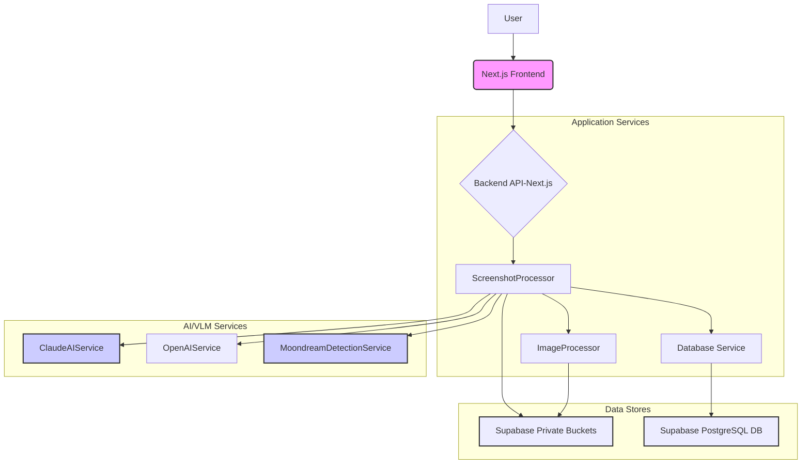
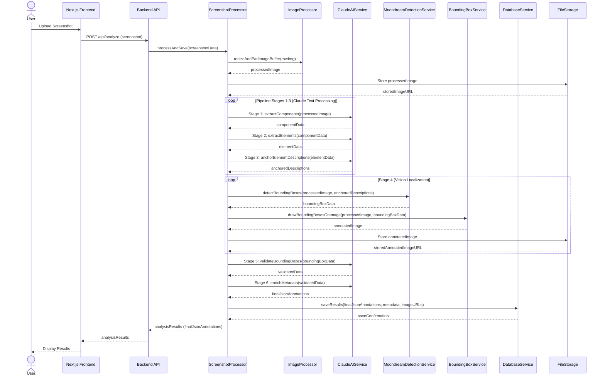
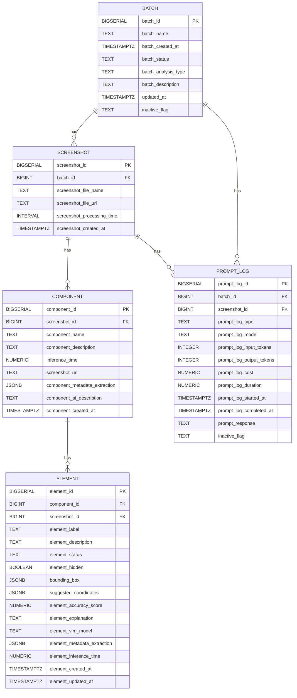
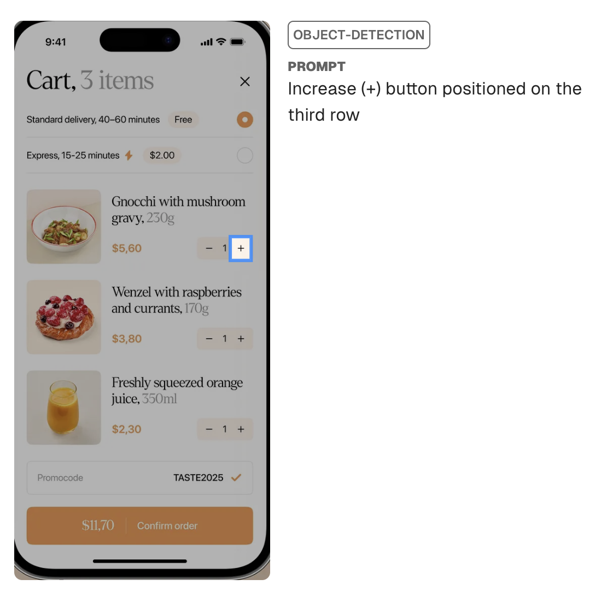
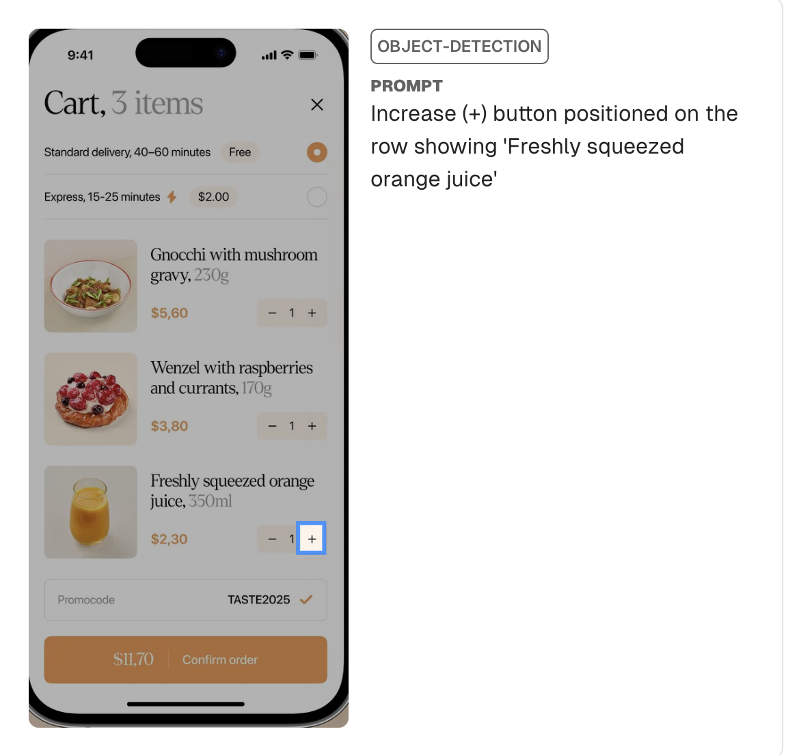

## 1. Project Overview
**Reimagining UX Annotation with MLLMs**

This project explores the capabilities of **vision-language models** with **zero-shot prompts** for **automated UI analysis**, particularly in challenging scenarios where components appear **visually similar**. Through a chain of **engineered prompts**, we investigate whether these models can reliably **extract**, **localize**, and **describe** UI elements from screenshots.

The system employs various **prompt engineering techniques** including:
- **Few-shot prompting**
- **Zero-shot prompting** 
- **Agentic prompting**

**Key findings from this project:**
1. **Vision-language models struggle** with precise UI component analysis when elements share similar visual characteristics
2. **Current models require extensive prompt engineering** to achieve basic accuracy
3. **Results show potential** but are far from production-ready

*   **Potential Enhancement:**
1. Incorporate Mobbin's UI pattern naming rules for consistent UX annotation in Step 6, which would improve metadata quality and alignment with Mobbin's standards.
2. Further break down the architecture to support a serverless approach (Vercel's 60s limit). This involves decomposing tasks into smaller, independent functions that can execute within the time constraints.
3. Leverage a more powerful vision-language model or fine-tune the VLM with segmentation models/methods 
- **QwenVL/Image Segmentation**: [GitHub Repository](https://github.com/carachu1/Qwen-VL-and-Image-Segmentation)
- **VLSM**: [arXiv PDF](https://arxiv.org/pdf/2405.06196)


## 2. Pipeline Overview
Seven-stage orchestrated pipeline transforming raw screenshots into detailed UX annotations:
1. Image preprocessing
2. High-level segmentation
3. Fine-grained extraction
4. Description refinement
5. Vision localization
6. Validation
7. Metadata enrichment

### High Level Diagrams


### Sequence Diagram

### ERD Diagram


## 3. Pipeline Stages (With Code References & Logic)

This section details each stage of the UI analysis pipeline, outlining its objective, the core reasoning behind its design, and its implementation.

### **Stage 0: Image Preprocessing**
* **How:**
  - Standardize images to 800x800px while preserving aspect ratio
  - Maintain consistent dimensions for UI rendering
  - Optimize resolution for token efficiency (Claude)
  - Sanitize filenames for safe storage

* **Implementation:**
    - `ImageProcessor.ts`, `ScreenshotProcessor.ts`
  - **Steps:**
    1. Validate image file, resize with aspect ratio preservation
    2. Add white padding to 800x800
    3. Convert to JPEG, Sanitize filename
    5. Prepare for storage and processing


* **Example Usage:**
  ```typescript
  // In ScreenshotProcessor.ts
  const fileBuffer = fs.readFileSync(uploadedFile.filepath);
  const originalFilename = uploadedFile.originalFilename || 'default_image.png';
  const processedImageOutput = await resizeAndPadImageBuffer(fileBuffer, originalFilename);
  // processedImageOutput.buffer ready for Stage 1 processing
  ```

---

### **Stage 1: High-Level UI Component Extraction**

*   **Objective:** Extract high-level UI components from preprocessed screenshots. Focuses on functional areas like navigation bars, product lists, and forms.

*   **Process:**
    1.  **Input:** Standardized image buffer and signed URL from Stage 0
    2.  **Model:** `OpenAIService.extract_component_from_image()` uses OpenAI's vision model with `EXTRACTION_PROMPT_v6` to identify major components
    3.  **Output:** Parses model response into array of objects with `component_name` and `description`

*   **Usage:**
    ```typescript
    // signedUrl is the preprocessed image URL
    // context is for logging
    const componentResult = await extract_component_from_image(signedUrl, context);
    // componentResult.parsedContent will be an array of { component_name, description }
    ```

---

### **Stage 2: Fine-Grained UI Element Extraction**

*   **Objective:** Break down each high-level component from Stage 1 into its distinct UI elements, such as buttons, labels, icons, and input fields.
*   **Importance:**
    *   **Comprehensive Inventory:** Creates a complete catalog of all UI elements, including both interactive components (buttons, inputs) and informational elements (labels, icons). 
    
    *   **Focused Analysis:** Leverages parent component context to:
        - Precisely identify elements within their specific UI section
        - Generate accurate descriptions tailored to each component's context
*   **Process:**
    1.  **Input:** The standardized image buffer (`signedUrl`) and the list of component names from Stage 1.
    2.  **Hierarchical Naming:** The model outputs a flat map with keys that suggest hierarchy (e.g., `Component Name > Element Label`).
    3.  **Data Aggregation:** The results are compiled into a JSON object mapping these keys to their detailed descriptions.

*   **Main Module:**
    *   [`ClaudeAIService.extract_element_from_image()`](/lib/services/ai/ClaudeAIService.ts)
    *   Prompt: `EXTRACT_ELEMENTS_PROMPT_v2` ([lib/prompt/prompts.ts])

---
### **Stage 3: Anchor-Aware Description Refinement**

*   **Objective:** Add spatial context to UI element descriptions using nearby visual references
*   **Purpose:**
    *   Improve VLM localization accuracy for small or generic elements
    *   Distinguish between visually similar elements
*   **Visual Comparison:** 
    - **Without Anchors:** 
    - **With Anchors:** 
*   **Process:**
    1.  **Input:** Image URL and element descriptions from Stage 2
    2.  **Model Processing:** `ClaudeAIService.anchor_elements_from_image()` uses `ANCHOR_ELEMENTS_PROMPT_v3` to:
        - Rewrite descriptions with 1-2 nearby visual references
        - Maintain focus on the target element
        - Use subordinate phrasing for anchors (e.g., "below the 'Settings' icon")

*   **Main Module:**
    *   [`ClaudeAIService.anchor_elements_from_image()`](/lib/services/ai/ClaudeAIService.ts)
    *   Prompt: `ANCHOR_ELEMENTS_PROMPT_v3` ([lib/prompt/prompts.ts])
*   **Typical Call (within `ParallelExtractionService.ts`):**
    ```typescript
    // elementResult.rawText is the output from Stage 2
    const anchorResult = await anchor_elements_from_image(signedUrl, elementResult.rawText, context);
    // anchorResult.parsedContent contains the anchor-enriched descriptions
    ```

---
### **Stage 4: Vision-Based Bounding Box Detection**

**Goal:**  
Pinpoint exact locations of UI elements by predicting their bounding box coordinates.

**Key Steps:**

1. **Input Preparation**  
   - Image buffer (processed screenshot)  
   - Anchor-enhanced element descriptions from Stage 3

2. **Vision-Language Model Processing**  
   - Uses `MoondreamDetectionService.detectBoundingBoxes()` function  
   - Specialized for spatial localization tasks (better than vision LLM) 
   - Processes one element description at a time for precision

3. **Element Detection Workflow**  
   - Individual VLM calls for each element  
   - Returns pixel coordinates: (x_min, y_min, x_max, y_max)  
   - Normalizes coordinates to image dimensions (0-1 or 0-100)

4. **Hierarchical Organization**  
   - Groups elements by their parent components  
   - Builds label hierarchy tree (e.g., "Category > SubCategory > Element")  
   - Dynamic grouping rules:  
     * Nodes with >2 children become groups  
     * Top-level nodes always form groups  
     * Elements assigned to deepest qualifying group

5. **Output & Visualization**  
   - Generates annotated images with bounding box overlays  

*   **Main Module:**
    *   [`MoondreamDetectionService.detectBoundingBoxes()`](/lib/services/ai/MoondreamDetectionService.js)
*   **Typical Call:**
    ```javascript
    // imageBuffer is the preprocessed image
    // anchoredDescriptions is the output from Stage 3
    const boundingBoxes = await MoondreamDetectionService.detectBoundingBoxes(imageBuffer, anchoredDescriptions);
    // boundingBoxes will be an array of {id, label, coordinates, score, status}
    ```

---

### **Stage 5: Bounding Box Accuracy Validation & Correction**

*   **Objective:** To critically assess the accuracy of bounding boxes predicted by the VLM (Stage 4) and, where possible, suggest corrections to improve their precision.
    * VLMs, while powerful, can still produce misaligned or inaccurately sized bounding boxes. This stage acts as a quality control mechanism.
    * Simulates human review but unoptimised; current accuracy may be flawed.
*   **How It Works (Design Decisions):**
    1.  **Input:** The original image, the bounding box JSON (from Stage 4) for each element, including its label and coordinates.
    2.  **Structured Feedback & Automated Correction:** 

        | Field                 | Type/Values            | Description                                                                 |
        |-----------------------|------------------------|-----------------------------------------------------------------------------|
        | `accuracy`            | Number (0-100)         | Confidence score for bounding box                              |
        | `status`              | `Verified`/`Overwrite` | Validation outcome - whether box is accepted or needs correction           |
        | `suggested_coordinates` | Object (optional)     | New coordinates provided when accuracy is low and correction is feasible   |
        | `explanation`         | String                 | Detailed rationale supporting the assessment                               |
        
*   **Main Module:**
    *   [`ClaudeAIService.validateBoundingBoxes()`](/lib/services/ai/ClaudeAIService.ts)
    *   Prompt: `ACCURACY_VALIDATION_PROMPT_v0` ([lib/prompt/prompts.ts])
*   **Typical Call:**
    ```typescript
    // boundingBoxes is the output from Stage 4
    // imageBuffer is the preprocessed image
    const validatedBoxes = await ClaudeAIService.validateBoundingBoxes(boundingBoxes, imageBuffer);
    // validatedBoxes contains the original box data plus accuracy, status, explanation, etc.
    ```

---

### **Stage 6: Structured Metadata Enrichment**

*   **Objective:** Generate standardized metadata for UI components and elements
*   **Current Implementation:**
    *   Uses experimental prompt (`METADATA_EXTRACTION_PROMPT_FINAL`)
    *   Extracts attributes of the component and the element in the UI screenshot with respect to the role they play
*   **Potential Enhancement:**
    *   Could incorporate Mobbin's UI pattern naming rules for consistent classification
    *   Would improve metadata quality and alignment with mobbin's standards
*   **Process:**
    1.  **Input:** Hierarchical JSON structure from previous stages + original image
    2.  **Metadata Extraction:** `ClaudeAIService.enrichMetadata()` extracts structured metadata as shown below:

        | Metadata Type | Fields Extracted                                                                 |
        |---------------|----------------------------------------------------------------------------------|
        | Components    | patternName, facetTags, states, interaction, userFlowImpact, flowPosition        |
        | Elements      | patternName, facetTags, states, interaction, userFlowImpact                      |
    3.  **Output:** Structured JSON with component and element metadata

*   **Main Module:**
    *   [`ClaudeAIService.enrichMetadata()`](/lib/services/ai/ClaudeAIService.ts)
    *   Prompt: `METADATA_EXTRACTION_PROMPT_FINAL` ([lib/prompt/prompts.ts])
*   **Typical Call:**
    ```typescript
    const metadata = await ClaudeAIService.enrichMetadata(componentHierarchy, imageBuffer);
    ```

---

## 5. Code Structure (Modules & Class Responsibilities)

| Module                                              | Responsibility                                                                                                                                | Key Exports/Classes                                                                                                                                     |
| --------------------------------------------------- | --------------------------------------------------------------------------------------------------------------------------------------------- | ------------------------------------------------------------------------------------------------------------------------------------------------------- |
| `/lib/services/imageServices/ImageProcessor.ts`     | Core image manipulation: resizing, padding, format conversion, filename sanitization.                                                       | `resizeAndPadImageBuffer()`, `deleteFile()`                                                                                                              |
| `/lib/services/imageServices/ScreenshotProcessor.ts`| Orchestrates screenshot processing: reads files, uses `ImageProcessor`, uploads to storage, records metadata in DB.                            | `ScreenshotProcessor`, `processAndSave()`                                                                                                                |
| `/lib/services/ai/ClaudeAIService.ts`               | Central LLM orchestration; prompt composition, sending, parsing, and validation for extraction, refinement, validation, and enrichment stages | `ClaudeAIService` (singleton), `extractComponents()`, `extractElements()`, `anchorElementDescriptions()`, `validateBoundingBoxes()`, `enrichMetadata()` |
| `/lib/services/ai/MoondreamDetectionService.js`     | Vision-Language detection using VLMs (bounding box prediction, confidence scoring, result normalization)                                      | `MoondreamDetectionService`, `detectBoundingBoxes()`                                                                                                    |
| `/lib/services/imageServices/BoundingBoxService.js` | Utilities for drawing, scaling, and normalizing bounding boxes; annotated image artifact creation                                             | `BoundingBoxService`, `drawBoundingBoxesOnImage()`                                                                                                      |
| `/lib/prompt/ExtractionPrompts.ts`                  | Prompt constant(s) for component extraction                                                                                                   | `EXTRACTION_PROMPT_v6`                                                                                                                                  |
| `/lib/prompt/ExtractElementsPrompts.ts`             | Prompt constant(s) for fine-grained element extraction                                                                                        | `EXTRACT_ELEMENTS_PROMPT_v2`                                                                                                                            |
| `/lib/prompt/AnchorElementsPrompts.ts`              | Prompt constant(s) for anchor-aware description refinement                                                                                    | `ANCHOR_ELEMENTS_PROMPT_v3`                                                                                                                             |
| `/lib/prompt/AccuracyValidationPrompts.ts`          | Prompt constant(s) for bounding box accuracy validation                                                                                       | `ACCURACY_VALIDATION_PROMPT_v0`                                                                                                                         |
| `/lib/prompt/MetadataExtractionPrompts.ts`          | Prompt constant(s) for structured metadata enrichment                                                                                         | `METADATA_EXTRACTION_PROMPT_FINAL`                                                                                                                      |
| `/lib/services/PromptTrackingContext.ts`            | Tracks prompt invocations and results for audit, debugging, and reproducibility                                                               | `PromptTrackingContext`                                                                                                                                 |
| `/lib/services/DatabaseService.ts`                  | Handles result persistence for runs, metadata, logs                                                                                           | `DatabaseService`                                                                                                                                       |
---

