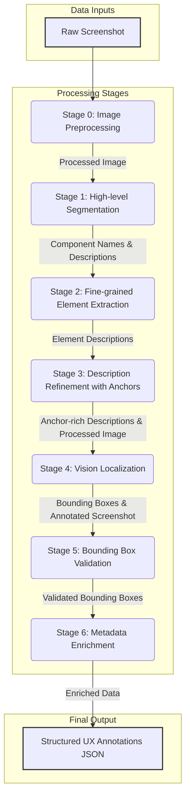

```mermaid
graph TD
    A[Raw Screenshot] --> B(Stage 0: Image Preprocessing);
    B -- Processed Image --> C(Stage 1: High-level Segmentation);
    C -- Component Names & Descriptions --> D(Stage 2: Fine-grained Element Extraction);
    D -- Element Descriptions --> E(Stage 3: Description Refinement with Anchors);
    E -- Anchor-rich Descriptions & Processed Image --> F(Stage 4: Vision Localization);
    F -- Bounding Boxes & Annotated Screenshot --> G(Stage 5: Bounding Box Validation);
    G -- Validated Bounding Boxes --> H(Stage 6: Metadata Enrichment);
    H -- Enriched Data --> I[Structured UX Annotations JSON];

    subgraph "Data Inputs"
        A
    end

    subgraph "Processing Stages"
        B
        C
        D
        E
        F
        G
        H
    end

    subgraph "Final Output"
        I
    end

    style A fill:#lightgrey,stroke:#333,stroke-width:2px
    style I fill:#lightgreen,stroke:#333,stroke-width:2px
``` 