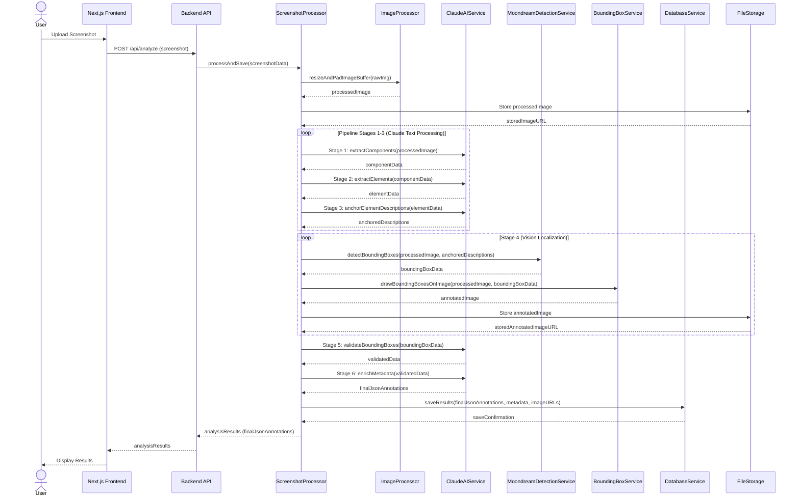

```mermaid
sequenceDiagram
    actor User;
    participant FE as Next.js Frontend;
    participant BE as Backend API;
    participant SP as ScreenshotProcessor;
    participant IP as ImageProcessor;
    participant CS as ClaudeAIService;
    participant MS as MoondreamDetectionService;
    participant BBS as BoundingBoxService;
    participant DS as DatabaseService;
    participant FS as FileStorage;

    User->>FE: Upload Screenshot;
    FE->>BE: POST /api/analyze (screenshot);
    BE->>SP: processAndSave(screenshotData);
    
    SP->>IP: resizeAndPadImageBuffer(rawImg);
    IP-->>SP: processedImage;
    SP->>FS: Store processedImage;
    FS-->>SP: storedImageURL;

    loop Pipeline Stages 1-3 (Claude Text Processing)
        SP->>CS: Stage 1: extractComponents(processedImage);
        CS-->>SP: componentData;
        SP->>CS: Stage 2: extractElements(componentData);
        CS-->>SP: elementData;
        SP->>CS: Stage 3: anchorElementDescriptions(elementData);
        CS-->>SP: anchoredDescriptions;
    end

    loop Stage 4 (Vision Localization)
        SP->>MS: detectBoundingBoxes(processedImage, anchoredDescriptions);
        MS-->>SP: boundingBoxData;
        SP->>BBS: drawBoundingBoxesOnImage(processedImage, boundingBoxData);
        BBS-->>SP: annotatedImage;
        SP->>FS: Store annotatedImage;
        FS-->>SP: storedAnnotatedImageURL;
    end

    SP->>CS: Stage 5: validateBoundingBoxes(boundingBoxData);
    CS-->>SP: validatedData;

    SP->>CS: Stage 6: enrichMetadata(validatedData);
    CS-->>SP: finalJsonAnnotations;

    SP->>DS: saveResults(finalJsonAnnotations, metadata, imageURLs);
    DS-->>SP: saveConfirmation;

    SP-->>BE: analysisResults (finalJsonAnnotations);
    BE-->>FE: analysisResults;
    FE-->>User: Display Results;
``` 